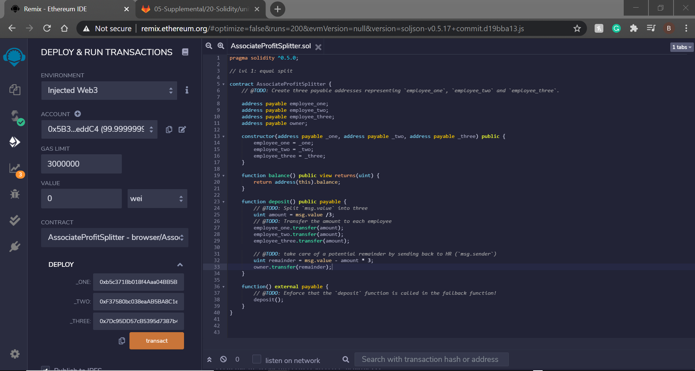
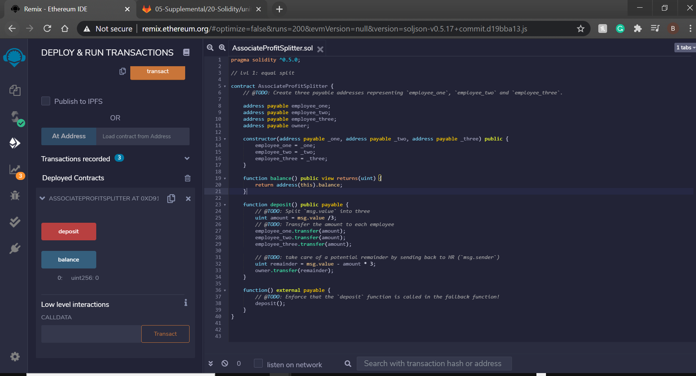

## Assignment 20

Purpose of Contract:

The AssociateProfitSplitter contract can be used to pay all of the same level of employees because the "/3" function divides the incoming payment equally among the 3 peope in the case study. The Owner can efficiently conduct the payroll process efficiently because they can deploy the contract every pay period and funds will be paid equally between the 3 same level tier employees. There is also the balance function included in the contract so payroll can verify if the contract was executed properly and all funds were distributed accordingly. There is also a function included that states the remainder should be returned to the owner if there are any excess funds from the transaction.

To execute this contract the owner needs to:
1) connect their Metamask account to an ETH network

2) enter the 3 employee’s wallets as addresses _ONE, _TWO, _THREE

3) deploy contract

4) check 'balance' = 0 

